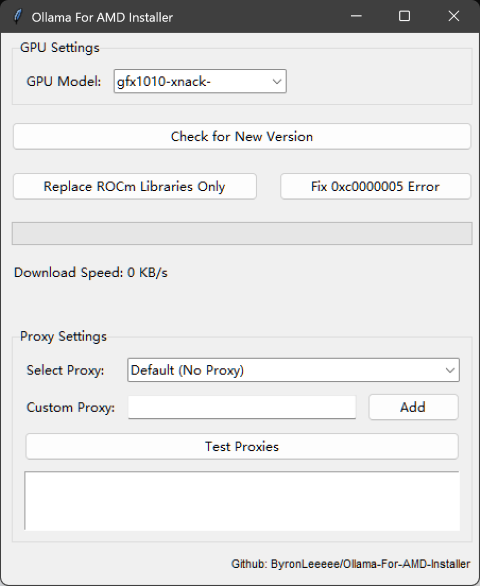

# Install Ollama with AMD Support on Windows
## Install HIP SDK (ROCm)
**ROCm** are the official drivers from AMD meant to allow AI models to run on **AMD GPUs**.
They add a compatibility layer which allows programs meant to run with **CUDA** to run on an AMD GPU.\
\
Go to the official [AMD site](https://www.amd.com/en/developer/resources/rocm-hub/hip-sdk.html) to download and install it.

> Even if your GPU doesn't appear on the [HIP SDK compatibility chart](https://rocm.docs.amd.com/projects/install-on-windows/en/latest/reference/system-requirements.html#supported-gpus-win),
> install it. The **Ollama For AMD** script will automatically install the needed extra support.
## Find out your GPU model
To install the required software for your GPU, you will need to know your specific model.
> **Example:** If you have a Radeon RX 6600, your model should be **gfx1032**
### Quickest Method
Open **cmd/powershell** and type 
``
clinfo | findstr "Device Name"
``
### Other methods
- Go to this [site](https://www.techpowerup.com/gpu-specs/) and search for your GPU. After finding it, use Ctrl+F to search for "gfx" in the specs.
- Ask chatgpt for the **LLVM target** of your GPU model (with the **Search** option on)

## Download and install [Ollama For AMD](https://github.com/likelovewant/ollama-for-amd) by [likelovewant](https://github.com/likelovewant)
We won't be installing the Ollama For AMD script directly. Instead we will use the [automated installer](https://github.com/ByronLeeeee/Ollama-For-AMD-Installer) developed 
by [ByronLeeeee](https://github.com/ByronLeeeee) that does all the hard work.
### **Download the latest release of the installer and execute it.**
Executing the installer will generate a windows warning message. This message is safe to ignore since it's related to the script being unknown and is not caused by malware detection.\
Downloading and executing the script will bring you to the following menu.\
 \
!\
 \
Choose your GPU model (**gfxXXXX**) on the dropdown menu + Click **check for new version**.\
Once the download is done you can close. An Ollama version compatible with your GPU should be installed.
## Check logs to find out if Ollama recognizes your AMD GPU
Run ``ollama run llama3.2:1b`` on **cmd**.\
Ask the model a question. Once it has finished answering, go to the bottom right corner and click on **Show Hidden Icons -> Ollama -> View logs**.\
Go to your oldest **serverX.log** file and search **gfx**. If your GPU model appears then Ollama has succesfully found your GPU.

